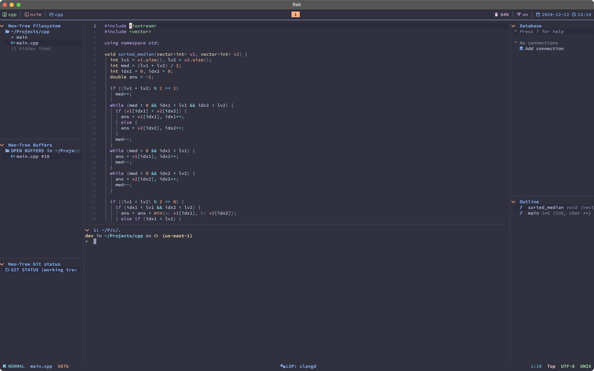

# Development Environment configuration

This repository provides configuration for the following development tools:

1. [Alacritty](https://alacritty.org/)
2. [Kitty](https://sw.kovidgoyal.net/kitty/)
3. [NeoVIM](https://neovim.io/)
4. [TMUX](https://github.com/tmux/tmux/wiki)
5. [Fish](https://fishshell.com/)
6. [Podman](https://podman.io/)

## Tools

I am using [Homebrew](https://brew.sh/) for managing my tools and packages on MacOS. It is also available for Linux.

Please install the following tools:

1. [Kitty](https://sw.kovidgoyal.net/kitty/): `brew install --cask kitty`
2. [Fish](https://fishshell.com/): `brew install fish`
3. [Starship](https://starship.rs/): `brew install starship`
4. [NeoVIM](https://neovim.io/) : `brew install neovim`
5. [TMUX](https://github.com/tmux/tmux/wiki) : `brew install tmux`
6. [Podman](https://podman.io/): `brew install podman podman-compose podman-tui`

## Instructions

Please clone this repository as it is to your `config` folder. (Example: `~/.config`)

## Preview

