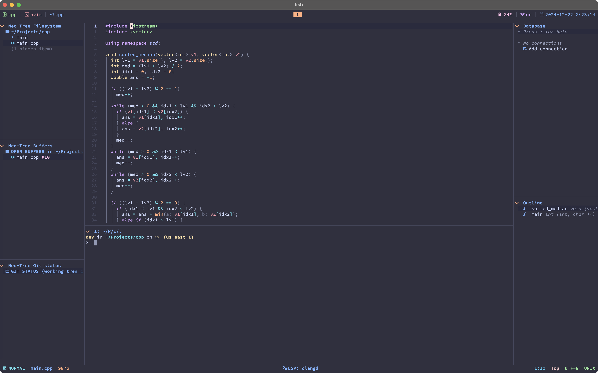

# Development Environment Configuration

This repository provides configuration for the following development tools:

1. [Alacritty](https://alacritty.org/)
2. [Kitty](https://sw.kovidgoyal.net/kitty/)
3. [NeoVIM](https://neovim.io/)
4. [TMUX](https://github.com/tmux/tmux/wiki)
5. [Fish](https://fishshell.com/)

## Preview

